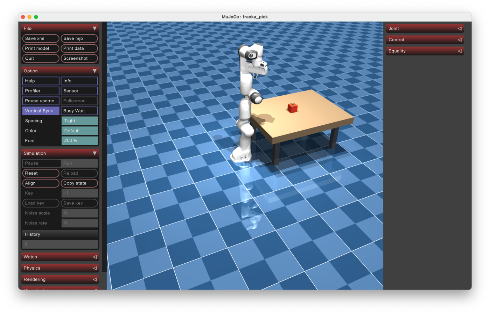
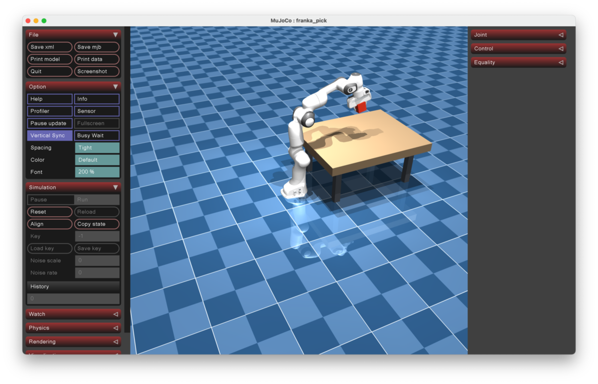

# MuJoCo Skill

A MuJoCo skill for Codex that helps AI agents handle MJCF scene construction, model checks, viewer startup, actuator inspection, and minimal control experiments more reliably.

Demo video: [Usage demo](https://www.youtube.com/watch?v=G2hwzWDg8Js&t=15s)

## Quick Guide

### 1. Install the Skill

Run this in your terminal:

```bash
npx skills@latest add coolbeevip/mujoco-skills
```

After installation, restart Codex so the new skill metadata is reloaded.

### 2. Create a Simulation Scene

Enter this in Codex:

> Use $mujoco to create a MuJoCo simulation scene with a franka_panda robot, a table, and a graspable object. Save it to ~/Documents/mujoco/franka_pick/scene.xml, then open the viewer to check whether the scene loads correctly.



### 3. Operate the Robot

Enter this in Codex:

> Use $mujoco to open ~/Documents/mujoco/franka_pick/scene.xml, inspect the franka_panda actuators and grasping site, then operate the robot to pick up the object on the table.



## More Scenarios

> Use $mujoco to create a Universal Robots UR5e sorting scene with a UR5e, a conveyor belt, two cubes in different colors, and two bins. Save it to ~/Documents/mujoco/ur5e_sort/scene.xml, then open the viewer to check it.

> Use $mujoco to create a Unitree Go1 quadruped obstacle-crossing scene with a Go1, a ground plane, low steps, and several obstacles. Save it to ~/Documents/mujoco/go1_obstacle/scene.xml, then open the viewer to check it.

> Use $mujoco to create a Hello Robot Stretch mobile manipulation scene with a Stretch, a tabletop, a cup, and a target tray. Save it to ~/Documents/mujoco/stretch_tabletop/scene.xml, then open the viewer to check it.

> Use $mujoco to create a Shadow Hand dexterous manipulation scene with a Shadow Hand, a tabletop, a sphere, and a cylinder. Save it to ~/Documents/mujoco/shadow_hand_dexterous/scene.xml, then open the viewer to check it.

## License

MIT License. See [LICENSE](LICENSE).
