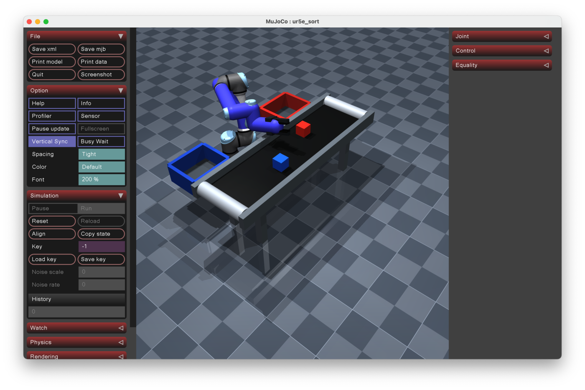
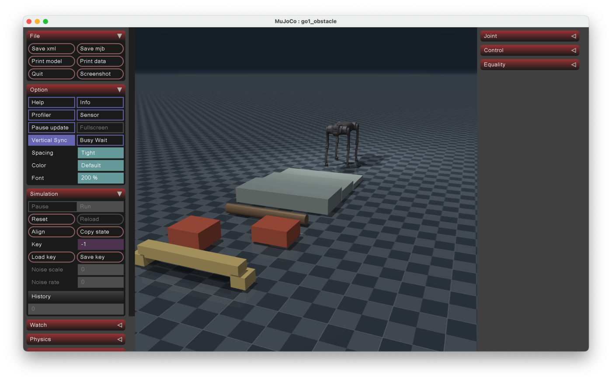
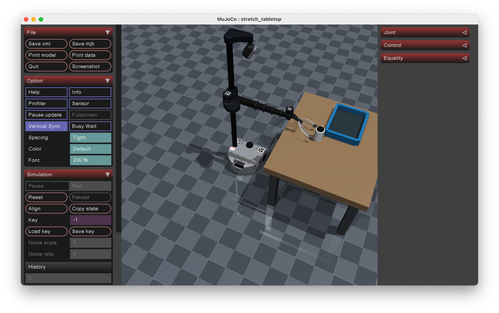
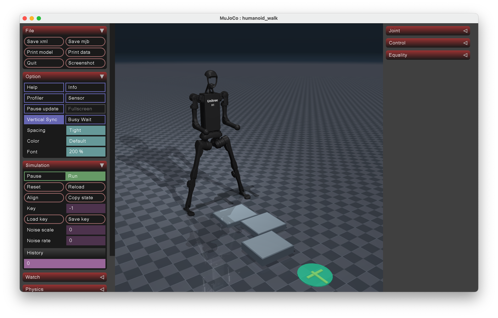
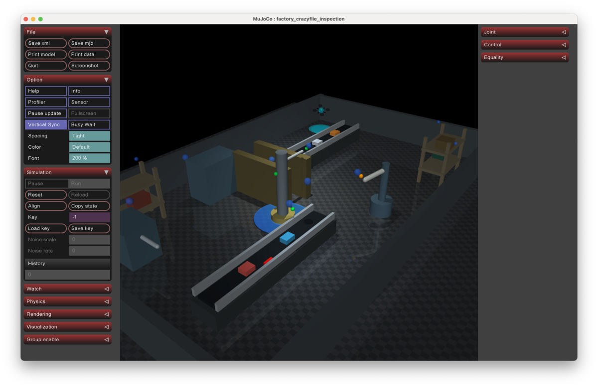
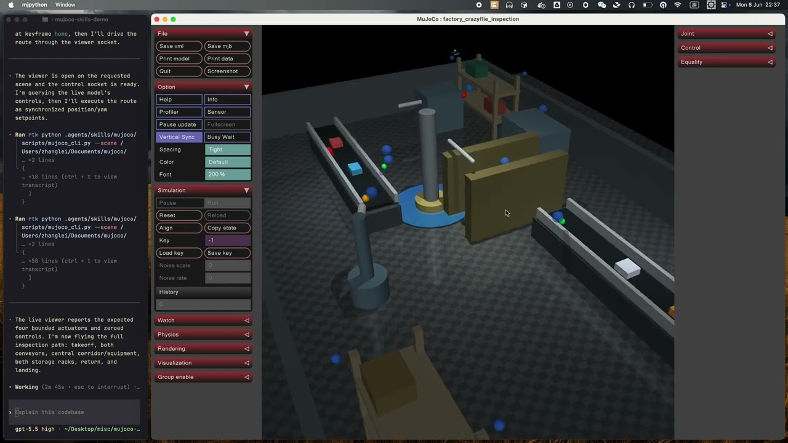

# MuJoCo Skill

[中文版本](README.zh-CN.md)

A MuJoCo skill for AI Agent that helps AI agents handle MJCF scene construction, model checks, viewer startup, actuator inspection, and minimal control experiments more reliably.

The examples and scene checks in this README were validated with Codex GPT-5.5.

## Quick Guide

### 1. Install the Skill

Run this in your terminal:

```bash
npx skills@latest add coolbeevip/mujoco-skills
```

After installation, restart Codex so the new skill metadata is reloaded.

### 2. Create a Simulation Scene

Enter this in Codex:

> Use $mujoco to create a MuJoCo simulation scene with a franka_panda robot, a table, and a graspable object. Save it to ~/Documents/mujoco/franka_pick/scene.xml, then open the viewer to check whether the scene loads correctly.


### 3. Operate the Robot

Enter this in Codex:

> Use $mujoco to open ~/Documents/mujoco/franka_pick/scene.xml, inspect the franka_panda actuators and grasping site, then operate the robot to pick up the object on the table.


## More Scenarios

> Use $mujoco to create a Universal Robots UR5e sorting scene with a UR5e, a conveyor belt, two cubes in different colors, and two bins. Save it to ~/Documents/mujoco/ur5e_sort/scene.xml, then open the viewer to check it.



> Use $mujoco to create a Unitree Go1 quadruped obstacle-crossing scene with a Go1, a ground plane, low steps, and several obstacles. Save it to ~/Documents/mujoco/go1_obstacle/scene.xml, then open the viewer to check it.



> Use $mujoco to create a Hello Robot Stretch mobile manipulation scene with a Stretch, a tabletop, a cup, and a target tray. Save it to ~/Documents/mujoco/stretch_tabletop/scene.xml, then open the viewer to check it.



> Use $mujoco to create a humanoid robot balance-and-walk scene with a humanoid robot, a ground plane, low stepping blocks, and a marked walking target. Save it to ~/Documents/mujoco/humanoid_walk/scene.xml, then open the viewer to check it.



> Use $mujoco to create a MuJoCo simulation of a modern manufacturing facility with production lines, industrial equipment, storage racks, narrow corridors, inspection checkpoints, and a charging pad. A Crazyflie quadrotor autonomously navigates through the factory, avoids obstacles, inspects equipment status indicators, detects anomalies, and returns to its home station.



> Use $mujoco to open ~/Documents/mujoco/factory_crazyflie_inspection/scene.xml, inspect the Crazyflie quadrotor body, actuators, cameras, and inspection waypoints, then operate the drone to take off from the home pad, fly through the factory inspection route, check both conveyor lines, inspect the central equipment area and storage racks, detect abnormal objects or blocked passages, and finally return to the home pad and land safely.

[](https://www.youtube.com/watch?v=7jF0NOPavmA)


## License

MIT License. See [LICENSE](LICENSE).
